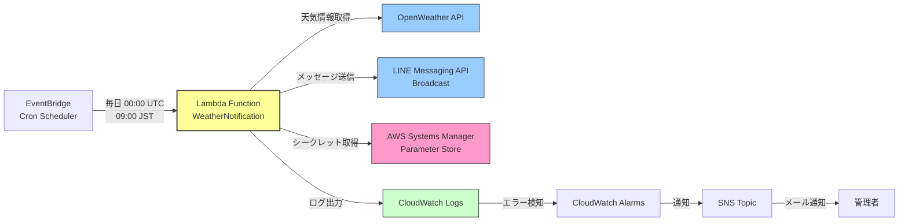
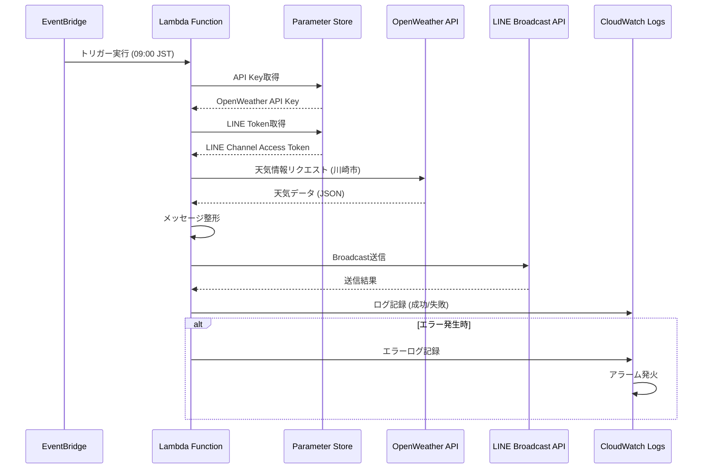
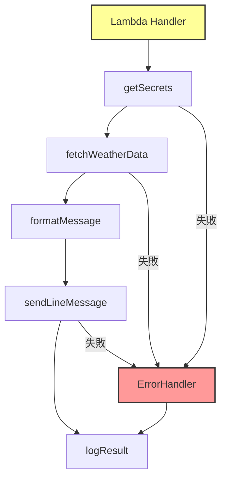
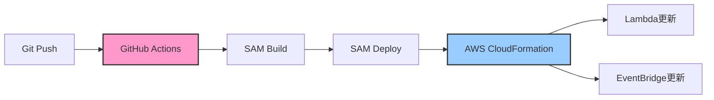

# 機能設計書

## 1. システム構成図

### 全体アーキテクチャ



### データフロー



---

## 2. コンポーネント設計

### 2.1 Lambda Function（WeatherNotification）

Lambda関数の内部構造：



#### モジュール構成

| モジュール名 | 責務 | 入力 | 出力 |
|------------|------|------|------|
| **handler** | Lambda関数のエントリーポイント | EventBridgeイベント | 実行結果 |
| **getSecrets** | Parameter Storeからシークレット取得 | パラメータ名 | API Key, Token |
| **fetchWeatherData** | OpenWeather APIから天気取得 | API Key, 都市座標 | 天気データ |
| **formatMessage** | 天気データをLINEメッセージに整形 | 天気データ | メッセージテキスト |
| **sendLineMessage** | LINE Broadcast APIでメッセージ送信 | メッセージ, Token | 送信結果 |
| **ErrorHandler** | エラーハンドリングとログ記録 | エラー情報 | ログ出力 |

---

### 2.2 データ構造

#### OpenWeather APIレスポンス（抜粋）

```typescript
interface OpenWeatherResponse {
  main: {
    temp_min: number;  // 最低気温 (Kelvin)
    temp_max: number;  // 最高気温 (Kelvin)
  };
  weather: Array<{
    description: string;  // 天気の説明
  }>;
  clouds: {
    all: number;  // 雲量 (%)
  };
  pop?: number;  // 降水確率 (0-1)
}
```

#### 内部データ構造

```typescript
interface WeatherData {
  maxTemp: number;      // 最高気温 (°C)
  minTemp: number;      // 最低気温 (°C)
  precipitation: number; // 降水確率 (%)
  description: string;  // 天気の説明
}
```

#### LINEメッセージ構造

```typescript
interface LineMessage {
  type: 'text';
  text: string;
}

interface BroadcastRequest {
  messages: LineMessage[];
}
```

---

### 2.3 外部API仕様

#### OpenWeather API

**エンドポイント**:
```
GET https://api.openweathermap.org/data/2.5/forecast
```

**パラメータ**:
| パラメータ | 値 | 説明 |
|-----------|-------|------|
| lat | 35.5309 | 川崎市の緯度 |
| lon | 139.7028 | 川崎市の経度 |
| appid | {API_KEY} | OpenWeather API Key |
| units | metric | 単位系（摂氏） |
| lang | ja | 言語（日本語） |

**レスポンス例**:
```json
{
  "list": [
    {
      "dt": 1735441200,
      "main": {
        "temp": 12.5,
        "temp_min": 10.2,
        "temp_max": 15.8
      },
      "weather": [
        {
          "description": "曇りがち"
        }
      ],
      "pop": 0.3
    }
  ]
}
```

#### LINE Messaging API (Broadcast)

**エンドポイント**:
```
POST https://api.line.me/v2/bot/message/broadcast
```

**ヘッダー**:
```
Authorization: Bearer {CHANNEL_ACCESS_TOKEN}
Content-Type: application/json
```

**リクエストボディ例**:
```json
{
  "messages": [
    {
      "type": "text",
      "text": "【川崎市の天気】\n最高気温: 15°C\n最低気温: 10°C\n降水確率: 30%"
    }
  ]
}
```

---

### 2.4 メッセージフォーマット

#### 送信メッセージ例

```
【川崎市の天気】(9時〜23時)
最高気温: 15°C
最低気温: 10°C
降水確率: 30%
天気: 曇りがち
```

#### フォーマット仕様
- 1行目: タイトル（都市名、時間帯）
- 2行目: 最高気温（整数、°C単位）
- 3行目: 最低気温（整数、°C単位）
- 4行目: 降水確率（整数、%単位）
- 5行目: 天気の説明（OpenWeather APIから取得）

---

## 3. エラーハンドリング戦略

### 3.1 エラー分類

| エラー種別 | 原因 | 対応 |
|-----------|------|------|
| **API取得エラー** | OpenWeather API障害/タイムアウト | ログ記録、アラーム通知 |
| **認証エラー** | Parameter Store取得失敗 | ログ記録、Lambda終了 |
| **LINE送信エラー** | LINE API障害/トークン無効 | ログ記録、アラーム通知 |
| **データパースエラー** | APIレスポンス形式不正 | ログ記録、デフォルト値使用 |
| **ネットワークタイムアウト** | 外部API応答遅延 | リトライ（最大3回） |

### 3.2 リトライ戦略

```typescript
// リトライ設定
const RETRY_CONFIG = {
  maxRetries: 3,
  retryDelay: 1000, // 1秒
  timeout: 10000,   // 10秒
};
```

- **対象**: OpenWeather API、LINE Broadcast API
- **リトライ回数**: 最大3回
- **リトライ間隔**: 1秒（固定）
- **タイムアウト**: 10秒

### 3.3 ログレベル

| レベル | 使用場面 | 例 |
|--------|---------|---|
| **INFO** | 正常処理 | "Weather data fetched successfully" |
| **WARN** | 軽微なエラー | "API response missing some fields" |
| **ERROR** | 重大なエラー | "Failed to send LINE message after 3 retries" |

---

## 4. セキュリティ設計

### 4.1 シークレット管理

**AWS Systems Manager Parameter Store**に以下を保存：

| パラメータ名 | 説明 | 暗号化 |
|------------|------|--------|
| `/weather-bot/openweather-api-key` | OpenWeather API Key | SecureString |
| `/weather-bot/line-channel-access-token` | LINE Channel Access Token | SecureString |

### 4.2 IAMロール権限

Lambda実行ロールに以下の権限を付与：

```yaml
Policies:
  - SSMParameterRead:  # Parameter Store読み取り
      - ssm:GetParameter
      - ssm:GetParameters
  - CloudWatchLogs:    # ログ出力
      - logs:CreateLogGroup
      - logs:CreateLogStream
      - logs:PutLogEvents
```

**最小権限の原則**: 必要な権限のみを付与

---

## 5. パフォーマンス設計

### 5.1 Lambda設定

| 項目 | 設定値 | 理由 |
|------|--------|------|
| **メモリ** | 256MB | 軽量な処理のため最小構成 |
| **タイムアウト** | 30秒 | API呼び出し2回+処理時間を考慮 |
| **ランタイム** | Node.js 20.x | 最新LTSバージョン |
| **アーキテクチャ** | arm64 | コスト削減（x86より約20%安価） |

### 5.2 実行時間見積もり

| 処理 | 想定時間 |
|------|---------|
| Parameter Store取得 | 0.5秒 |
| OpenWeather API呼び出し | 1-3秒 |
| メッセージ整形 | 0.1秒 |
| LINE Broadcast API呼び出し | 1-3秒 |
| **合計** | **3-7秒** |

---

## 6. 監視・アラート設計

### 6.1 CloudWatch Logs

**ロググループ**: `/aws/lambda/weather-notification`
**保持期間**: 7日間

### 6.2 CloudWatch Alarms

| アラーム名 | 条件 | 通知先 |
|-----------|------|--------|
| **Lambda実行失敗** | エラー率 > 10% (5分間) | SNS Topic |
| **Lambda実行なし** | 実行回数 = 0 (1日) | SNS Topic |

### 6.3 SNS通知

**トピック名**: `weather-bot-alerts`
**サブスクリプション**: 管理者のメールアドレス

---

## 7. スケーリング設計

### 7.1 現在の構成
- **同時実行数**: 1（1日1回の実行）
- **ユーザー数**: LINE友達数に依存（想定: 10-100人）

### 7.2 将来の拡張性
- **複数都市対応**: Lambda関数のパラメータ化
- **複数実行時刻**: EventBridgeルール追加
- **ユーザー個別設定**: DynamoDB追加、ユーザーごとの設定管理

---

## 8. デプロイメント設計

### 8.1 デプロイフロー



### 8.2 環境分離

| 環境 | 用途 | デプロイ条件 |
|------|------|------------|
| **dev** | 開発・テスト | feature/* ブランチへのPush |
| **prod** | 本番環境 | main ブランチへのMerge |

---

## 9. テスト設計

### 9.1 テスト戦略

| テスト種別 | 対象 | ツール |
|-----------|------|--------|
| **ユニットテスト** | 各モジュール | Vitest |
| **統合テスト** | Lambda全体フロー | SAM Local |
| **手動テスト** | 実際のLINE配信 | 本番環境（テストユーザー） |

### 9.2 テストカバレッジ目標
- **ユニットテスト**: 80%以上
- **統合テスト**: 主要フロー100%

---

## 10. 制約事項

### 10.1 技術的制約
- OpenWeather API無料枠: 1日1,000回まで（本アプリは1日1回）
- LINE Messaging API無料枠: 月500通まで
- Lambda実行時間: 最大15分（本アプリは30秒で設定）

### 10.2 ビジネス制約
- 川崎市のみ対応（初期バージョン）
- 配信時刻は固定（09:00 JST）
- ブロードキャスト配信のみ（個別設定なし）

---

## 11. 将来の拡張ポイント

### Phase 2 機能候補
- **ユーザー個別設定**: DynamoDB導入、Webhook実装
- **複数都市対応**: 都市マスタ管理
- **配信時刻カスタマイズ**: ユーザーごとのスケジュール管理

### Phase 3 機能候補
- **天気アラート**: 大雨警報などの緊急通知
- **リッチメッセージ**: Flex Messageで画像・アイコン表示
- **週間天気予報**: 7日間の天気情報配信
